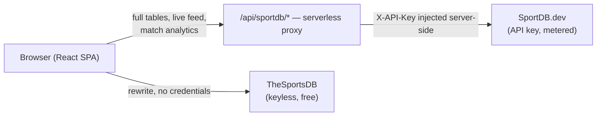

# Live Football Scores

Live football scores, full league standings and match analytics — built on a
quota-aware serverless API proxy that keeps provider credentials off the client.

[](https://github.com/letera1/Sport-Web/actions/workflows/ci.yml)
[](LICENSE)


**Live demo:** https://livefootballscores.vercel.app

---

## Contents

- [Features](#features)
- [Architecture](#architecture)
- [Getting started](#getting-started)
- [Configuration](#configuration)
- [Scripts](#scripts)
- [Project structure](#project-structure)
- [Data integrity policy](#data-integrity-policy)
- [Deployment](#deployment)
- [Contributing](#contributing)
- [License](#license)

---

## Features

| Area | Detail |
| --- | --- |
| **Live scores** | All in-play fixtures across every competition the provider covers, with status filters, search and competition grouping |
| **Standings** | Complete league tables (all 20 Premier League clubs, all 36 Champions League league-phase clubs), including form guide and provider-defined qualification zones |
| **Match analytics** | Timeline, expected goals (xG/xGOT/xA), possession, shot breakdown, per-player ratings, formations, and real bookmaker odds with opening-price drift |
| **Team profiles** | Crest, stadium, country and full deduplicated squad list |
| **Responsive UI** | Verified with zero horizontal overflow from 390 px to 1440 px |
| **Theming** | Dark by default with a light theme, driven by CSS custom properties |

## Architecture

The app reads from two independent providers, chosen per feature:



The proxy in [`api/`](api) exists because the metered provider's key must never
reach the browser, and because the free plan allows a limited number of requests
per month. Every request passes through, in order: **route allowlist → rate
limit → cache → capability check → budget check → in-flight dedupe → upstream**.

See [docs/ARCHITECTURE.md](docs/ARCHITECTURE.md) for the full design and
[docs/API.md](docs/API.md) for the endpoint reference.

## Getting started

### Prerequisites

- **Node.js 20.19+** (CI runs 22)
- **npm 10+**

### Install and run

```bash
git clone https://github.com/letera1/Sport-Web.git
cd Sport-Web
npm install
cp .env.example .env
npm run dev
```

The app starts on http://localhost:5173.

> Without a `SPORTDB_API_KEY` the app still runs: standings fall back to the
> keyless provider and return a partial table, flagged in the UI. Live scores and
> match analytics require the key.

## Configuration

Copy [`.env.example`](.env.example) to `.env`. Two classes of variable exist, and
the distinction is a security boundary, not a convention:

| Prefix | Visibility | Use for |
| --- | --- | --- |
| `VITE_*` | **Bundled into the browser** | Non-secret configuration only |
| no prefix | Server-side only | Credentials and proxy limits |

| Variable | Required | Default | Purpose |
| --- | --- | --- | --- |
| `SPORTDB_API_KEY` | For live/analytics | — | SportDB.dev credential. Server-only. |
| `SPORTDB_REQUEST_BUDGET` | No | `800` | Hard ceiling on upstream calls per window |
| `SPORTDB_ALLOWED_SPORTS` | No | `football` | Sports the proxy will forward at all |
| `SPORTDB_RL_MAX` | No | `30` | Per-IP requests per minute against the proxy |
| `VITE_API_BASE_URL` | No | `/api/v1/json/3` | Keyless provider base path |

In production, set these in **Vercel → Project → Settings → Environment
Variables**. Never commit `.env`.

## Scripts

| Command | Description |
| --- | --- |
| `npm run dev` | Start the dev server, including a local stand-in for the serverless proxy |
| `npm run build` | Type-check, then produce a production build |
| `npm run preview` | Serve the production build locally |
| `npm run lint` | ESLint across the repository |
| `npm run typecheck` | Type-check the app **and** the serverless functions |
| `npm run verify` | Everything CI runs, in one command |

> `npm run typecheck:app` uses `tsc -b` so project references are followed.
> A plain `tsc --noEmit` passes unconditionally in this repo, because the root
> `tsconfig.json` declares no files of its own.

## Project structure

```
.
├── api/                      # Vercel serverless functions (server-only)
│   ├── _lib/                 # Underscore prefix keeps these out of routing
│   │   ├── cache.ts          # TTL cache, stale-while-error, in-flight dedupe
│   │   ├── config.ts         # Env parsing; validates the upstream origin
│   │   ├── metrics.ts        # Counters and the feature capability registry
│   │   ├── proxy.ts          # Runtime-agnostic request pipeline
│   │   ├── rateLimit.ts      # Per-IP fixed window
│   │   ├── routes.ts         # Upstream allowlist and per-feature TTLs
│   │   └── sportdbClient.ts  # Injects the key; retries only network/5xx
│   ├── sportdb-proxy.ts      # HTTP entry point
│   └── tsconfig.json         # Node16 + strict; these files are not in the app config
├── docs/
│   ├── API.md                # Provider and proxy endpoint reference
│   ├── ARCHITECTURE.md       # Design decisions and data flow
│   └── DEPLOYMENT.md         # Vercel deployment and troubleshooting
├── src/
│   ├── api/client.ts         # axios instance with retry/backoff
│   ├── components/           # Presentational components
│   ├── contexts/             # Theme and favourites providers
│   ├── hooks/                # Data-fetching hooks, one per feature
│   ├── lib/utils.ts          # cn() and shared helpers
│   ├── pages/                # Route-level components
│   ├── services/
│   │   ├── sportdb/          # Metered provider: client, normalizers, models
│   │   └── sportsApi.ts      # Keyless provider: cache + endpoint wrappers
│   ├── constants.ts          # Leagues, endpoints, cache TTLs
│   └── types.ts              # Keyless-provider entity types
└── vercel.json               # Rewrites: proxy routing, image hosts, SPA fallback
```

Components bind to the normalized models in
[`src/services/sportdb/models.ts`](src/services/sportdb/models.ts), never to raw
provider JSON, so swapping a provider stays contained to the normalizers.

### Routes

| Path | Page |
| --- | --- |
| `/` | Dashboard — fixtures by date |
| `/live` | All in-play matches |
| `/match/:id` | Match detail (`?src=sportdb` selects the analytics provider) |
| `/standings` | League tables |
| `/team/:id` | Team profile and squad |
| `/player/:id` | Player profile |

## Data integrity policy

**Nothing displayed is invented.** Values the provider does not supply are
rendered as an explicit gap, never as a plausible-looking default. `null` means
"not supplied" and is never silently coerced to `0`.

This is enforced by convention in the normalizers and has removed several
generations of fabricated content from this codebase, including randomised
standings rows, hash-derived "bookmaker" odds, and generated play-by-play text.
Partial data is labelled as partial; it is never padded.

## Deployment

The project targets **Vercel**, which serves the static build and hosts the
functions in `api/`. Both are required — a static-only host cannot run the proxy,
so the metered provider's features would be unavailable.

```bash
npm i -g vercel
vercel link
vercel --prod
```

Set `SPORTDB_API_KEY` in the project's environment variables before the first
production deploy. Full instructions and a troubleshooting guide covering the
failure modes this project has actually hit are in
[docs/DEPLOYMENT.md](docs/DEPLOYMENT.md).

## Contributing

Contributions are welcome. Please read [CONTRIBUTING.md](CONTRIBUTING.md) and the
[Code of Conduct](CODE_OF_CONDUCT.md) first. Run `npm run verify` before opening
a pull request — it runs exactly what CI runs.

## License

[MIT](LICENSE)

## Acknowledgements

- [TheSportsDB](https://www.thesportsdb.com) and [SportDB.dev](https://sportdb.dev) for the data
- [Lucide](https://lucide.dev) for the icon set
