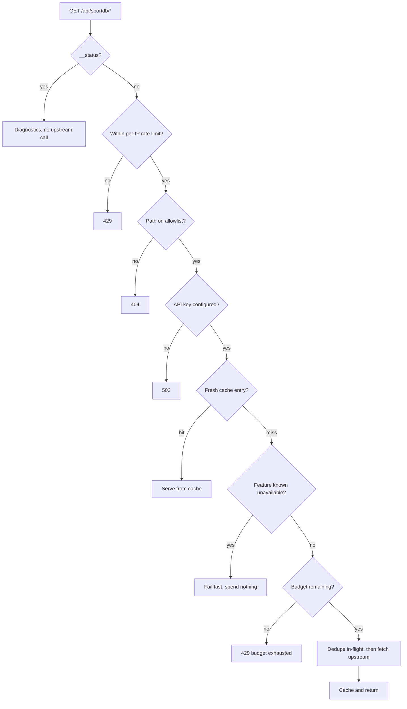

# Architecture

This document explains how the application is put together and, more usefully,
*why* — including the constraints that forced each decision.

## Contents

- [Constraints](#constraints)
- [Provider strategy](#provider-strategy)
- [The serverless proxy](#the-serverless-proxy)
- [Request pipeline](#request-pipeline)
- [Quota management](#quota-management)
- [Client data flow](#client-data-flow)
- [Type-checking layout](#type-checking-layout)
- [Conventions](#conventions)

## Constraints

Three constraints shape almost every decision here:

1. **The metered provider's key must never reach the browser.** A pure SPA
   cannot hold a credential, so a server-side component is mandatory.
2. **The free plan allows a limited number of requests per month.** Naive
   polling would exhaust it within a day.
3. **Free tiers return partial data.** The keyless provider caps league tables at
   five rows and omits crests entirely.

## Provider strategy

The app is deliberately hybrid. Each provider is used where it is strongest.

| Provider | Auth | Cost | Used for |
| --- | --- | --- | --- |
| **TheSportsDB** | None | Free, effectively unmetered | Fixtures by date, player/team lookups, crest fallback |
| **SportDB.dev** | `X-API-Key` | Metered per month | Live feed, complete standings, match analytics, squads |

The keyless provider remains the default for anything it can serve correctly,
which keeps the metered budget for data only it can supply.

### Why not one provider?

TheSportsDB returns only the top five rows of any league table on the free tier,
and its bulk team endpoint caps at ten of twenty clubs. A complete table is not
obtainable from it at any amount of request volume. SportDB.dev supplies the full
table in a single call — but is metered, so it cannot serve every page view.

## The serverless proxy

Everything under `/api/sportdb/*` is handled by a single Vercel function.

```
api/
├── _lib/                 # Underscore prefix excludes these from routing
│   ├── config.ts         # Env parsing; upstream origin is operator-set and https-validated
│   ├── routes.ts         # Allowlist of permitted upstream paths + per-feature TTLs
│   ├── cache.ts          # TTL cache, stale-while-error, in-flight dedupe
│   ├── rateLimit.ts      # Per-IP fixed window against our own endpoint
│   ├── metrics.ts        # Counters + capability registry
│   ├── sportdbClient.ts  # Injects X-API-Key; retries only network/5xx
│   └── proxy.ts          # Runtime-agnostic pipeline
└── sportdb-proxy.ts      # HTTP entry point
```

`proxy.ts` deliberately knows nothing about Vercel. It accepts
`{ segments, query, clientId }` and returns `{ status, headers, body }`. This
keeps it runnable from two places: the Vercel function in production, and a Vite
middleware plugin during development, so `npm run dev` behaves like production
without requiring the Vercel CLI.

### Security properties

- **The key is never bundled.** It has no `VITE_` prefix, so Vite cannot inline
  it, and nothing under `src/` references it. CI asserts both.
- **SSRF is structurally prevented.** `routes.ts` is an allowlist: a request that
  does not match a known pattern is rejected before any upstream call. The
  upstream origin comes from operator configuration, never from user input.
- **Path traversal is rejected twice** — once by the allowlist, and again by an
  explicit segment guard, because the entry point decodes segments itself.
- **Only `page` is forwarded** from the incoming query string. Arbitrary
  parameters are dropped rather than passed upstream.
- **Errors never echo the key**, and it is never logged.

## Request pipeline

Order matters; each stage exists to avoid work or spend in the next.



## Quota management

Four independent mechanisms protect the monthly allowance:

| Mechanism | Effect |
| --- | --- |
| **Per-feature TTL cache** | Live 45 s, standings 2 h, fixtures 6 h, competition 7 d, team 3 d |
| **In-flight dedupe** | Concurrent identical requests collapse into one upstream call |
| **Capability registry** | A `401`/`402`/`403` marks that feature unavailable, so it is never retried |
| **Hard budget** | A ceiling on upstream calls per window, independent of the provider's own accounting |

Client-side, two further guards apply:

- **Lazy tab loading** — match sub-resources load on first visit to their tab, so
  a visitor who only reads the summary costs one request, not four.
- **Idle and visibility pausing** — live polling stops when the tab is hidden and
  after ten minutes without interaction. Manual refresh always remains available.
- **Permanent crest caching** — resolved team logos persist in `localStorage`, so
  a given team costs at most one lookup per browser, ever.

`GET /api/sportdb/__status` reports budget, cache statistics and per-feature
availability without making an upstream call.

## Client data flow

```
Page → Hook → Client → /api/sportdb/* → Normalizer → Domain model → Component
```

Components bind to the domain models in `src/services/sportdb/models.ts` and
never to raw provider JSON. A provider change is therefore contained to the
normalizer layer.

Normalizers follow one rule: **pass official values through untouched, and
represent everything else as `null`.** They never round, zero-fill or synthesise.

### Standings: graceful degradation

`useStandings` attempts the metered provider first for a complete table. On
failure it falls back to the keyless provider and sets `partial: true`, which the
UI surfaces as an explicit note. Crests are enriched progressively *after* first
paint, so the table renders immediately.

## Type-checking layout

Three TypeScript projects, checked separately:

| Config | Covers | Notes |
| --- | --- | --- |
| `tsconfig.app.json` | `src/` | Bundler resolution, strict |
| `tsconfig.node.json` | Build tooling | |
| `api/tsconfig.json` | `api/` | **Node16** resolution, strict |

Two consequences are easy to trip over:

- `api/` is **not** covered by `tsconfig.app.json`. It needs its own check, which
  `npm run typecheck:api` provides and CI runs. Omitting it once allowed a
  non-compiling function to reach production while the build stayed green.
- Because `package.json` sets `"type": "module"`, the `api/` project uses Node16
  resolution, which **requires explicit `.js` extensions** on relative imports —
  even though the files themselves are `.ts`.

The root `tsconfig.json` declares `"files": []` and only project references, so
`tsc --noEmit` against it checks nothing and always succeeds. Use `tsc -b`.

## Conventions

- **Named exports** for components; default export only for `App`.
- **One hook per feature**, owning its own loading and error state.
- **Tailwind via CSS custom properties** (`rgb(var(--color-x) / <alpha-value>)`),
  so theming is a variable swap rather than a class rewrite.
- **Comments explain the non-obvious** — a constraint, a platform quirk, or a
  decision — never what the next line already says.
